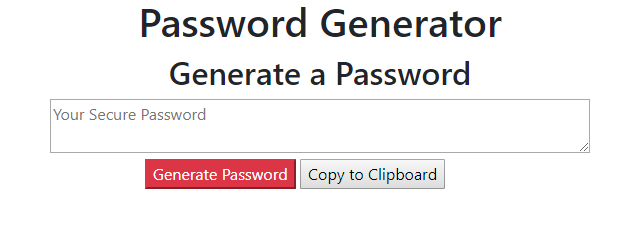

# Password-Generator
This is a random password generator that takes user input for what they would like to contain in their new password, puts those inputs into a string, and generates a random combination containing at least one character from each input, to provide a secure password.

# Deployed Application
https://cassquatch.github.io/Password-Generator/

# Built From

* HTML
* CSS
* Bootstrap
* Javascript

# Functionality
When the user clicks generate, they are prompted with several questions to determine what they would like in their password. How long, which character sets they would like, etc. A random password is then generated, and may be copied to the clipboard with the copy to clipboard button.

# Author
Cassidy Fortner

